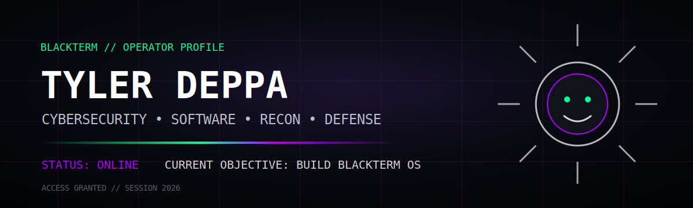
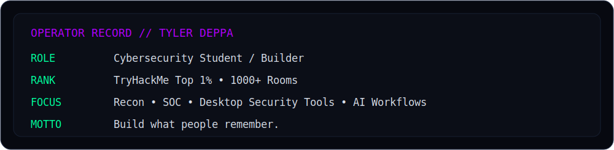

<p align="center">
  
</p>

<p align="center">
  <a href="https://github.com/cojjjj/blackterm-platform"></a>
  
  
</p>

```text
[ BLACKTERM // OPERATOR CONSOLE ]

BOOT SEQUENCE ................................ COMPLETE
OPERATOR ..................................... TYLER DEPPA
CLEARANCE .................................... BUILDER
PRIMARY OBJECTIVE ............................ BUILD MEMORABLE SECURITY SOFTWARE
CURRENT SYSTEM ............................... BLACKTERM PLATFORM v6.0
STATUS ....................................... ONLINE
```

## `> whoami`

```text
Cybersecurity student focused on ethical hacking, defensive security,
and building desktop tools that feel like real products—not throwaway scripts.

Current focus:
  • Python desktop engineering
  • Reconnaissance and threat intelligence
  • Event-driven security tooling
  • SOC workflows and investigation UX
  • Turning BLACKTERM into a full cybersecurity workspace
```

<p align="center">
  
</p>

## `> mission-control`

<p align="center">
  <a href="https://github.com/cojjjj/blackterm-platform">
    
  </a>
</p>

<p align="center">
  <b>BLACKTERM Platform</b><br/>
  AI-assisted reconnaissance, live telemetry, threat context, case timelines, reporting, and a desktop-first Mission Control interface.
</p>

<p align="center">
  <a href="https://github.com/cojjjj/blackterm-platform"></a>
  <a href="https://github.com/cojjjj/blackterm-platform/blob/main/ROADMAP.md"></a>
</p>

## `> active-projects`

<table>
<tr>
<td width="50%" valign="top">

### `01 // BLACKTERM PLATFORM`
**Status:** `ACTIVE`

Desktop cybersecurity workspace with Mission Control, reconnaissance, live events, AI analysis, reports, and investigation workflows.

[Open repository →](https://github.com/cojjjj/blackterm-platform)

</td>
<td width="50%" valign="top">

### `02 // HOME SOC LAB`
**Status:** `DETECTION READY`

Wazuh, Sysmon, Windows telemetry, endpoint monitoring, and hands-on blue-team detection engineering.

[View repositories →](https://github.com/cojjjj?tab=repositories&q=soc&type=&language=&sort=)

</td>
</tr>
<tr>
<td width="50%" valign="top">

### `03 // CALENDAR OCR`
**Status:** `SHIPPED`

Screenshot-to-calendar automation using OCR, Python, and Google Calendar integration.

[Open repository →](https://github.com/cojjjj/walmart-calendar-sync-ocr)

</td>
<td width="50%" valign="top">

### `04 // THE ARCHIVE`
**Status:** `EVOLVING`

An eerie interactive desktop experience blending software, narrative systems, puzzles, and BLACKTERM worldbuilding.

[Browse projects →](https://github.com/cojjjj?tab=repositories)

</td>
</tr>
</table>

## `> capability-map`

<p align="center">
  
</p>

```text
OFFENSIVE SECURITY .......... Reconnaissance • Web Testing • Enumeration
DEFENSIVE SECURITY .......... Wazuh • Sysmon • SIEM • Detection Workflows
SOFTWARE ENGINEERING ........ Python • PySide6 • SQLite • Testing • Packaging
INFRASTRUCTURE .............. Docker • Linux • Windows • Networking
CURRENT TARGET .............. BLACKTERM OS EXPERIENCE
```

## `> current-mission`

```text
BLACKTERM OS

Desktop Window Manager   [██████░░░░] 60%
Interactive Network Map  [█████░░░░░] 50%
AI Investigation Engine  [████░░░░░░] 40%
Case Management          [███░░░░░░░] 30%
Plugin Ecosystem         [██░░░░░░░░] 20%
```

## `> field-record`

<p align="center">
  
  
</p>

<p align="center">
  
</p>

## `> contact`

<p align="center">
  <a href="https://www.linkedin.com/in/tyler-deppa-2523a0345"></a>
  <a href="mailto:deppatyler@gmail.com"></a>
  <a href="https://www.instagram.com/tyler.deppa"></a>
  <a href="https://www.youtube.com/@dyyeet1806"></a>
</p>

```text
SYSTEM LOG

NO LOGS. NO WITNESSES. JUST CODE.

BLACKTERM // SESSION ACTIVE
```

<p align="center">
  
</p>
