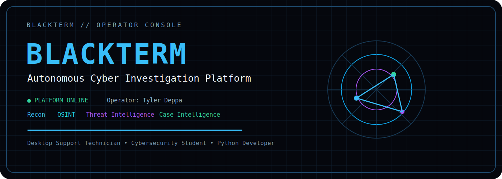
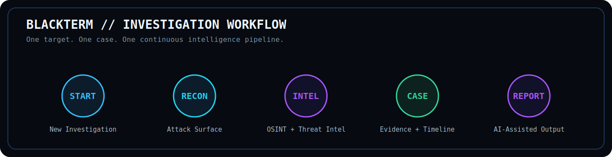
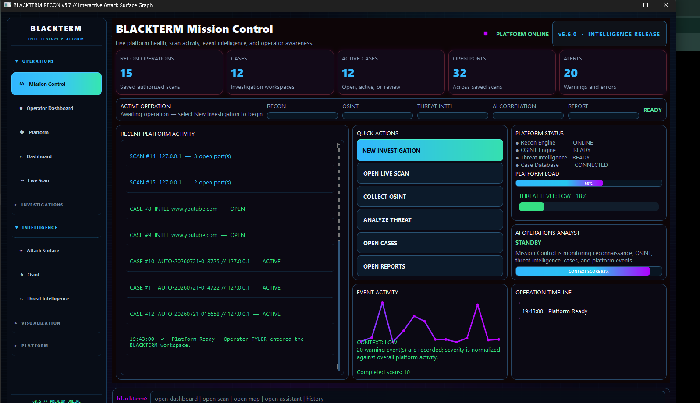
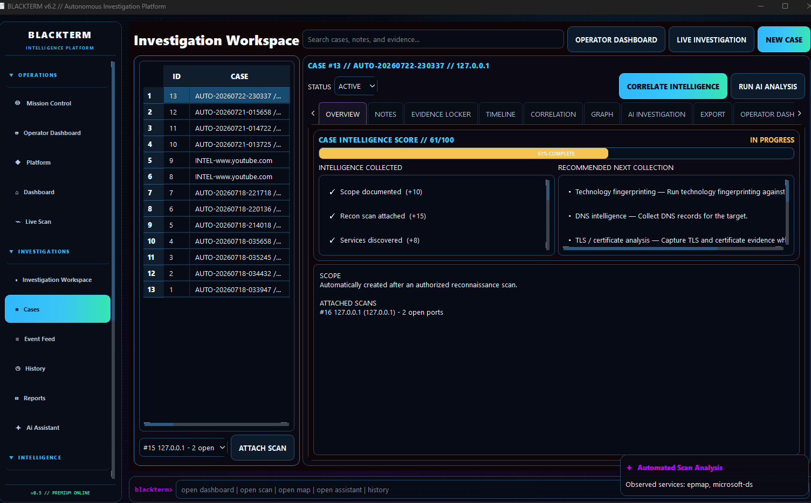
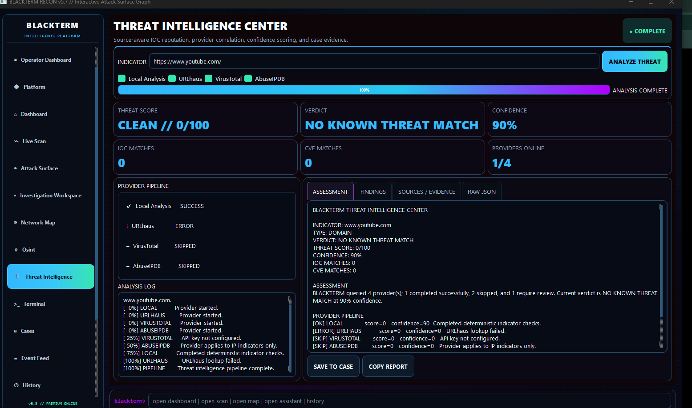
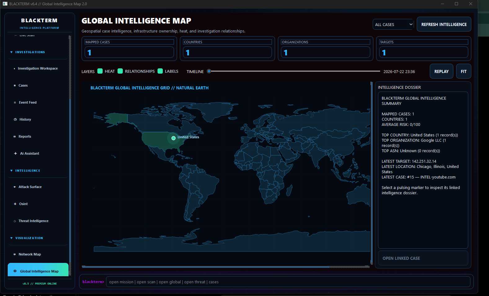
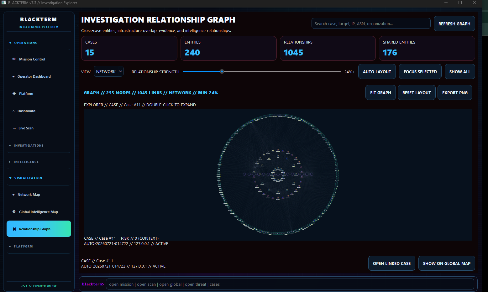

<div align="center">



<br/>

[](https://github.com/cojjjj/blackterm-platform)


</div>

## `blackterm> whoami`

```yaml
operator: Tyler Deppa
role: Desktop Support Technician
education: Cybersecurity Student
current_mission: Building BLACKTERM
focus:
  - Cyber Investigation Platforms
  - Threat Intelligence
  - OSINT
  - Detection Engineering
  - Python Security Tooling
```

I build practical cybersecurity software that turns raw technical data into structured investigations. My flagship project, **BLACKTERM**, combines reconnaissance, intelligence enrichment, case management, visualization, and AI-assisted reporting in one desktop platform.

## `blackterm> workflow --visualize`



## `blackterm> platform --modules`

| Module | State | Purpose |
|---|:---:|---|
| Mission Control | `ONLINE` | Launch and monitor operations |
| Recon Engine | `ONLINE` | Discover authorized hosts and services |
| Attack Surface Intelligence | `ONLINE` | Prioritize exposure and findings |
| OSINT Engine | `ONLINE` | Enrich targets with public-source intelligence |
| Threat Intelligence Center | `ONLINE` | Analyze indicators and reputation |
| Investigation Workspace | `ONLINE` | Manage cases, evidence, notes, and timelines |
| Global Intelligence Map | `ONLINE` | Visualize geospatial case intelligence |
| Investigation Explorer | `ONLINE` | Correlate entities across cases |
| AI Investigation | `ACTIVE` | Summarize findings and recommend next actions |

## `blackterm> featured --project`

### BLACKTERM Platform

> A modular desktop platform for authorized reconnaissance, OSINT, threat intelligence, investigation management, intelligence visualization, and reporting.

[](https://github.com/cojjjj/blackterm-platform)

### BLACKTERM OS

> An operating-system-inspired cybersecurity portfolio built with React, TypeScript, and Vite.

[](https://github.com/cojjjj/blackterm-os)

## `blackterm> gallery --platform`

### Mission Control



### Investigation Workspace



### Threat Intelligence Center



### Global Intelligence Map



### Investigation Explorer



## `blackterm> skills --stack`

<p align="center">


</p>

## `blackterm> achievements --operator`

- Top 1% on TryHackMe
- 1000+ completed rooms
- Desktop support and real-world troubleshooting experience
- Building a large Python cybersecurity investigation platform
- Hands-on offensive, defensive, networking, and digital-investigation labs

## `blackterm> telemetry --github`

<p align="center">
  
  
</p>

<p align="center">
  
</p>

## `blackterm> roadmap --next`

```text
BLACKTERM
├── Autonomous Investigation Workflows
├── Cross-Case Intelligence
├── Investigation Explorer
├── Global Intelligence Mapping
├── AI Correlation
├── Plugin Ecosystem
└── Commercial-Grade Packaging
```

---

<div align="center">

### `NO LOGS. NO WITNESSES. JUST CODE.`

[](https://github.com/cojjjj)

</div>
